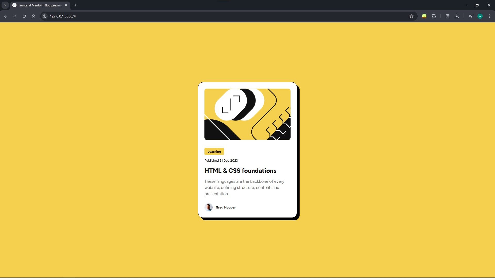
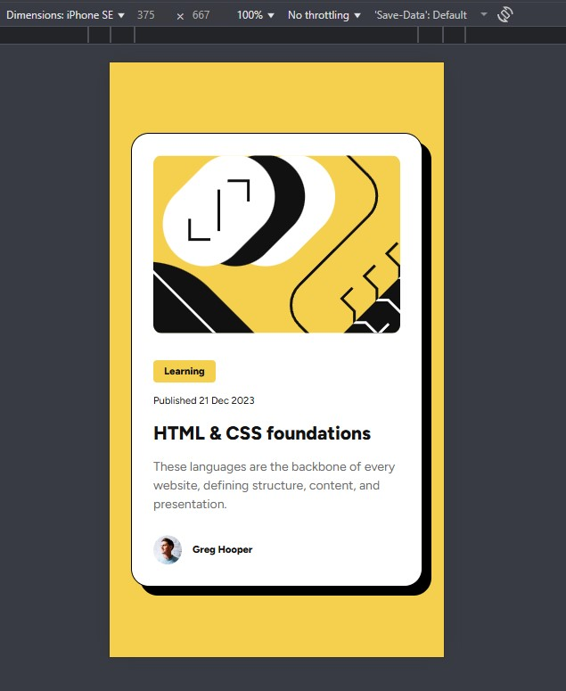
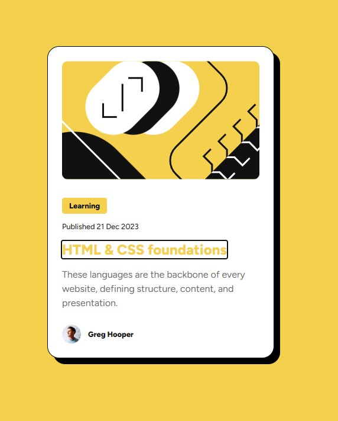

# Frontend Mentor - Blog preview card solution

This is a solution to the [Blog preview card challenge on Frontend Mentor](https://www.frontendmentor.io/challenges/blog-preview-card-ckPaj01IcS).

## Table of contents

- [Overview](#overview)
  - [The challenge](#the-challenge)
  - [Screenshot](#screenshot)
- [My process](#my-process)
  - [Built with](#built-with)
  - [What I learned](#what-i-learned)
  - [Continued development](#continued-development)
  - [Useful resources](#useful-resources)

## Overview

### The challenge

Users should be able to:

- See hover and focus states for all interactive elements on the page

### Screenshot

- Desktop version

- Mobile version

- Focus state

## My process

### Built with

- Semantic HTML5 markup
- CSS custom properties
- Flexbox

### What I learned

По ходу выполнения задания:
- вспомнил некоторые свойства flexbox; 
- вспомнил псевдоклассы :hover, :active, :focus
- узнал про функцию clamp для адаптивного размера шрифта;
- использовал object-fit на изображении для достижения адаптивной верстки.

### Continued development

Стоит обратить внимание на:
- Распределение объектов внутри flexbox
- Адаптирование изображений
- Использование SVG-изображений

### Useful resources

- [w3schools.com CSS Flex Container](https://www.w3schools.com/css/css3_flexbox_container.asp) - Статья на w3schools о flexbox container.
- [w3schools.com CSS The object-fit Property](https://www.w3schools.com/css/css3_object-fit.asp) - Статья на w3schools о свойстве object-fit.
- [w3schools.com HTML time Tag](https://www.w3schools.com/tags/tag_time.asp) - Статья на w3schools о теге time.
- [MDN "Using CSS custom properties (variables)" article](https://developer.mozilla.org/en-US/docs/Web/CSS/CSS_cascading_variables/Using_CSS_custom_properties) - статья на MDN об использовании переменных
- [MDN box-shadow article](https://developer.mozilla.org/en-US/docs/Web/CSS/box-shadow) - статья на MDN о свойстве box-shadow
